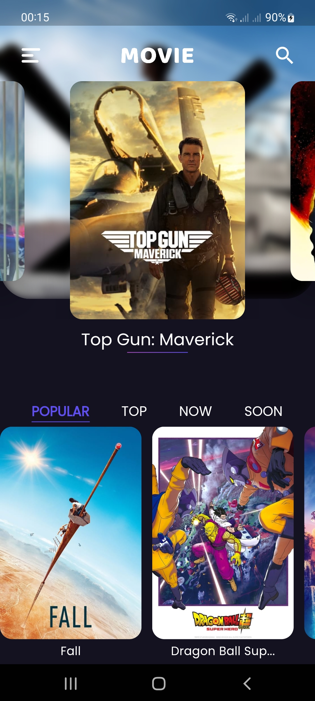
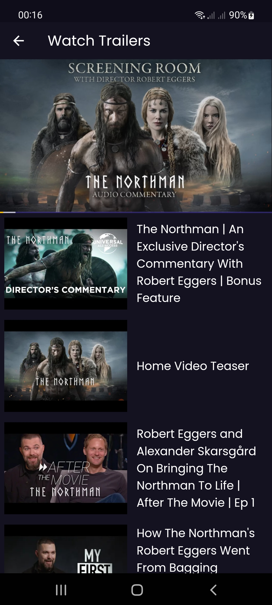

# Movie App

Your Guide to The World of Movies.

## Features
* This application shows you the top, most popular, new and coming soon movies.
* You can check the details of any movie such as the story, year of release, rating, trailers and the cast.
* You also can add any movie you like to your favorites.
* Search for any movie by its name.
* Change the language to Spanish or English.
* Send a feedback in case of any errors or suggetions.

## Screenshots
Home Screen             |  Detail Screen              |  Trailers Screen
:-------------------------:|:-------------------------: |:-------------------------:
  |   | 

## Technologies and Packages used
- equatable: ^2.0.5 (for comparison of objects)
- http: ^0.13.4 (for network calls)
- dartz: ^0.10.1 (for error handling)
- get_it: ^7.2.0 (for dependencies)
- google_fonts: ^3.0.1
- flutter_bloc: ^8.1.1 (to implement the BLoC (Business Logic Component))
- bloc: ^8.1.0 (helps implement the BLoC)
- flutter_svg: ^1.1.3
- cached_network_image: ^3.2.1 (to load and cache network images)
- flutter_screenutil: ^5.5.3+2 (for adapting screen and font size)
- wiredash: ^1.5.0 (to get feedbacks)
- hive: ^2.2.3 (for local storage)
- path_provider: ^2.0.11
- youtube_player_flutter: ^8.1.0 (for playing YouTube videos)
- flare_flutter: ^3.0.2 (for animations)

## Author
- Twitter: [@Dilman01](https://twitter.com/dilman01)
- Github: [@Dilman01](https://github.com/Dilman01)
